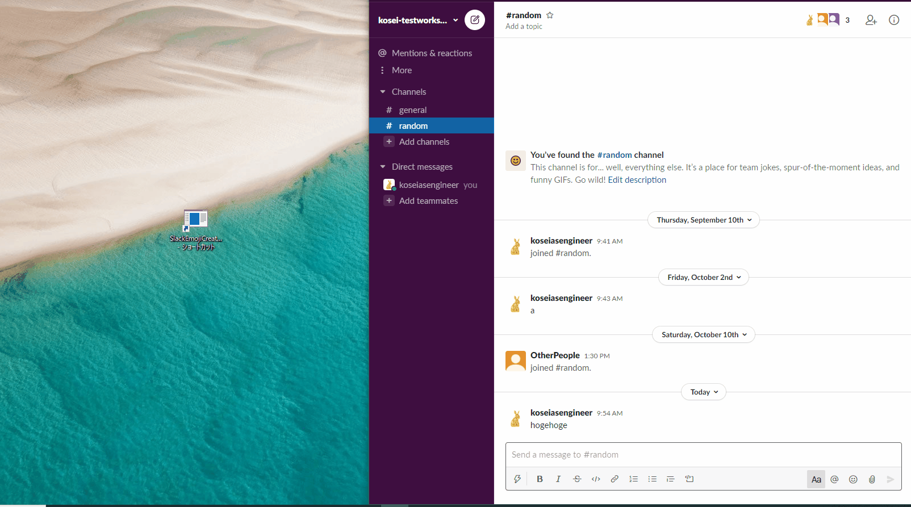

[日本語版README](/README_resources/README_ja.md)

# EasySlackEmojiCreator

"EasySlackEmojiCreator" enable to create slack emojis and upload them quickly.

# DEMO

# Features

* You can create slack emojis by just typing text.
* Add created emoji to your workspace just by pushing button, once you register your slack team token
  * It's not necessary to open your workspace customize web page to upload.
  * You need to register you token again when you signed out.

# Getting started

Prerequisites

* Your computer must be running Windows 10
* .NET Core 3.0 Runtime (or later) is installed 
  * If it's not installed, you will be required when you open the .exe file.

### Get application  

* Download latest version from [release page](https://github.com/KoseiYoshida/EasySlackEmojiCreator/releases)  

or

* Build application
  * Install the latest version of [Visual Studio](https://developer.microsoft.com/en-us/windows/downloads) (the free community edition is sufficient) or other build tool.
  * Get the code:
    * git clone https://github.com/KoseiYoshida/EasySlackEmojiCreator.git
  * Open [SlackEmojiCreator.sln](https://github.com/KoseiYoshida/EasySlackEmojiCreator/blob/master/SlackEmojiCreator.sln) in Visual Studio to build and run the app.

### Get token  

You need to get token at the first time and after you singed out from your workspace.

* Open your workspace customize page.
  * Click your workspace name on the left top corner on your slack page.
  * Select "Administration > Customize ~~~".
* [Open your browser's dev tools](http://webmasters.stackexchange.com/a/77337)
* Find token from the browser's dev tool.
  * Go to the Network tab.
  * Reload browser.
  * Find the "emoji.list?~~" from the column "Name" and click it.
  * Open "Headers" tab and find "token" from "Form Data".
* Copy token. (Token may start from "xoxs~")

### Register token  

* Open application.
* Click "Account" button. (A dialog will be shown)
* Enter your "WorkspaceName" and "EmojiListToken".
* Click "Save" button.
* Close dialog.

### Create and upload emojis  

* Create emoji
  * Input text into the textbox on the left top corner.
  * Choose color and font family.
  * Click "Add" button to add current emoji to upload candidates.
* Upload
  * Click "Upload" button.

# License
"EasySlackEmojiCreator" is under [MIT license](https://en.wikipedia.org/wiki/MIT_License).
